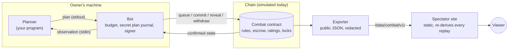
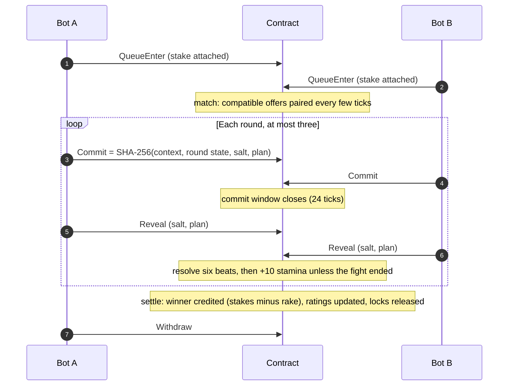

# Architecture: how the pieces fit

> **Purpose:** the moving parts of QDOJO, one fight's lifecycle, and what is real versus simulated today. \
> **Audience:** everyone who reads code; contract and protocol reviewers; operators. \
> **Status:** reference. Normative detail lives in the documents linked from each section. \
> **Last verified:** 2026-09-25 against `packages/qdojo/src/qdojo/combat/`, `contracts/`, `apps/web/` and the `Dockerfile`.

## Contents

1. [The system](#1-the-system)
2. [One fight, end to end](#2-one-fight-end-to-end)
3. [Real, simulated, not built](#3-real-simulated-not-built)
4. [Code map](#4-code-map)
5. [Verification](#5-verification)

## 1. The system

| Piece | Owns | Never does |
|---|---|---|
| **Planner** | Choosing six actions and a power slot from one observation | Sign, spend, or see a salt, key or the opponent's live plan |
| **Bot** | Spending decisions within a budget, salts, commit and reveal, restart recovery | Replace a plan after committing |
| **Contract** | Accepted actions, deadlines, combat resolution, escrow, credits, ratings, locks | Call out to an oracle, a bot or the website |
| **Exporter** | Public copies of confirmed state | Decide anything; publish a plan before its reveal |
| **Site** | Presentation and independent replay checks | Hold a key, sign, or grant a result |

The contract is the only authority. Everything to its right is a replaceable
view; a lagging export is "unknown", never evidence that a bot missed a deadline.

## 2. One fight, end to end

| Step | What happens | Owning document |
|---|---|---|
| Offer | A funded, expiring offer enters the book (ranked queue, named duel or cup entry) | [matchmaking.md](matchmaking.md), [competition.md](competition.md) |
| Match | The contract pairs compatible offers by a fixed, bounded rule | [matchmaking.md](matchmaking.md) §2–3 |
| Commit | Each bot sends a hash that binds its plan to this fight, round and state | [protocol.md](protocol.md) §2 |
| Reveal | After the commit window closes, each bot reveals salt and plan | [protocol.md](protocol.md) §4 |
| Resolve | Six simultaneous beats from the integer rules; a knockout ends the fight | [combat.md](combat.md) §6–7 |
| Settle | Credits, rake split, rating change, record, once and idempotently | [spec.md](spec.md) §5, [competition.md](competition.md) §1 |

A bot that commits but never reveals forfeits the whole contest to a compliant
opponent; if both miss, it is a double fault and both stakes come back. The
exact deadlines and failure rules are in [protocol.md](protocol.md) §4–5.

## 3. Real, simulated, not built

| Layer | Today | Where |
|---|---|---|
| Rules engine | **Real.** Python, C++ and browser engines agree on 10,000 frozen fights | `combat/engine.py`, `contracts/combat_core/`, `apps/web/combat/engine.js` |
| Practice and NPCs | **Real**, local and free | `combat/npcs.py`, `combat/training.py` |
| Contract logic | **Real code, simulated chain.** The reference contract runs in-process; `SimChain` adds latency, drops, reordering and execution fees | `combat/contract.py`, `combat/chainsim.py` |
| Contract on Qubic | **Written, not deployed.** Passes Core's contract checker and replays the parity journals in core-lite's harness | `contracts/qubic/QDOJO.h` |
| Fighter NFTs | **Simulated.** Issuer, name, one unit, owner history and a small market in the demo arena | `combat/chainsim.py` (`AssetRegistry`) |
| Money | **Fake QU only.** No real QU is escrowed or paid | — |
| Identities | **Synthetic**, derived from labels on the devnet; no seed is read | `combat/sim.py` |
| Opponent history for planners | **Not built.** `history_manifest` is always empty; planners see only earlier rounds of the current fight | `combat/training.py`, `combat/devnet.py` |
| Deployment manifest | **Not built.** Without one, paid admission stays disabled | [product-decisions.md](product-decisions.md) |

The public demo arena at [qdojo.jonsggi.com](https://qdojo.jonsggi.com/) is the
reference contract on `SimChain`, driven by operator-run bots, exported every
few ticks and proxied to the static site. See [operations.md](operations.md) §8.

## 4. Code map

All paths under `packages/qdojo/src/qdojo/combat/` unless noted.

| Module | Role |
|---|---|
| `types.py`, `rules.py`, `rulesets/` | States, plans, enums; the packaged ruleset and its digest check |
| `engine.py` | Pure beat, round and fight resolution: no I/O, clock, randomness or floats |
| `codec.py` | Canonical bytes, digests, commitments, opcodes |
| `npcs.py`, `evaluate.py` | The six NPCs; research policies (`search-v1`, `reader-v1`), pools and the benchmark runner |
| `planner.py`, `llm_planner.py` | The planner subprocess contract; an OpenRouter-backed planner with a daily spend cap |
| `training.py` | Local practice fights, replay verification, "where it cost you" explanations |
| `contract.py`, `ledger.py`, `matchmaking.py`, `rating.py`, `series.py` | The reference contract and its pure parts |
| `sim.py`, `chainsim.py`, `devnet.py`, `store.py` | Fake chain, realistic simulated chain, persistent local devnet, journals |
| `bot.py` | The owner bot: budgets, secret plan journal, commit/reveal, duels and cups |
| `export.py` | Public JSON under `/data/combat/v1/` |
| `live.py` | The demo arena runner (`qdojo combat live`) |
| `cli.py`, `chain_cli.py` | `qdojo combat …` |
| `invariants.py` | Conservation and consistency checks used by tests and the soak |
| `apps/web/combat/` | Browser engine, ruleset, NPC port, replay verifier and the site app |

## 5. Verification

Combat-v1 is built for direct execution: the contract receives commitments and
reveals, runs bounded integer combat and credits the result. No external
oracle, EVM judge or submitted bot code is involved. (Earlier oracle research
is [archived](archive/riddle-v0/docs/verification-research.md).)

The site checks each replay separately and shows the strongest level it earned:

| Level | Meaning |
|---|---|
| `REPLAY_MATCH` | The browser recomputed every commitment and replayed every beat from the revealed plans; all matched. Chain inclusion is not proven |
| `COMBAT_VERIFIED` | Every check passed, including confirmed inclusion on chain. A same-source export cannot earn it |
| `HASH_MATCH_ONLY` | Only hashes could be checked |
| `UNVERIFIED` / `FAILED` | Nothing could be checked / something did not match |

Today the best a replay can reach is `REPLAY_MATCH`, because the chain is
simulated and the export comes from the same operator. The checks themselves
are listed in [api.md](api.md) §4.
